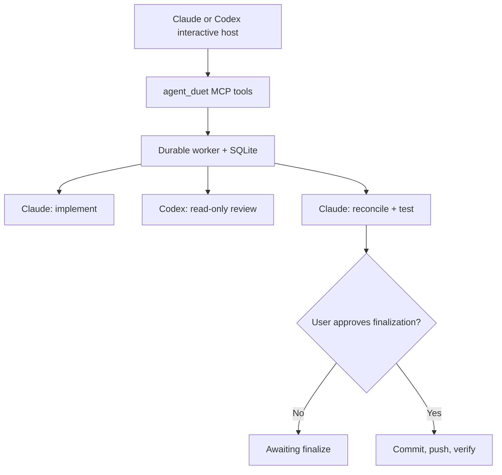
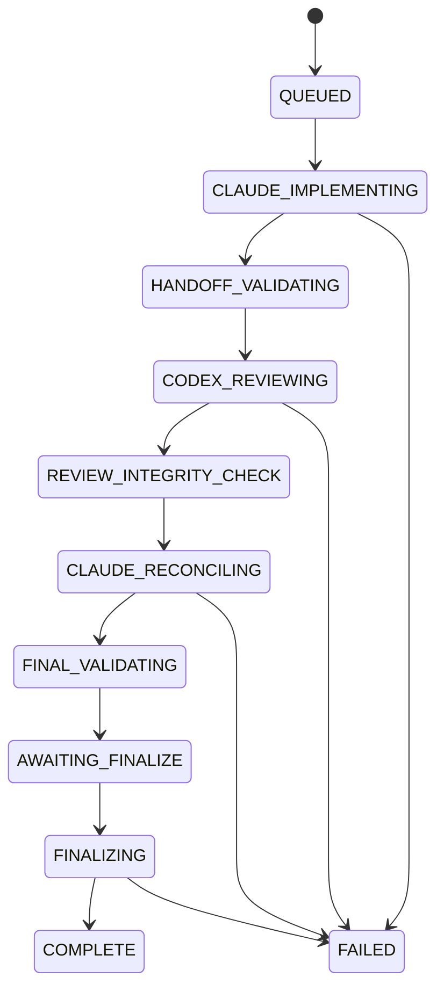

# Agent Duet: a safe Claude Code ↔ Codex MCP coordinator

Research checked: **2026-09-04**  
Target systems: **Arch Linux** and **Ubuntu 24.04**  
Target clients: **Claude Code CLI** and **OpenAI Codex CLI**

## The recommendation

Build one local, Python-based **stdio MCP coordinator** named `agent_duet`. Install the same pinned version on each PC and register it with both Claude Code and Codex. Either interactive terminal can then start the identical workflow with one request:

1. a fresh Claude Code process implements and prepares a handoff;
2. a fresh Codex process performs an independent, mechanically read-only review;
3. a fresh Claude Code process adjudicates the critique, fixes justified findings, and validates the result;
4. the coordinator pauses for approval;
5. a separate finalization tool commits, pushes, and optionally verifies deployment.

This eliminates the manual copy/paste in the supplied three-message workflow while retaining its separation of duties.

Do **not** build the solution around either of these commands:

- `claude mcp serve` only exposes Claude Code's tools; the MCP client still has to provide the agent logic and confirmations. [Anthropic documents this limitation](https://code.claude.com/docs/en/mcp#use-claude-code-as-an-mcp-server).
- `codex mcp-server` was deprecated by OpenAI on August 24, 2026. [OpenAI now directs new integrations toward the Codex app server/plugin](https://learn.chatgpt.com/docs/mcp-server). The supported `codex exec` command remains appropriate for a local, non-interactive review worker.

The custom coordinator is necessary because MCP standardizes tools, resources, and prompts; it does not automatically merge Claude and Codex conversations or supply your application-specific state machine. That architectural conclusion is an inference from the [MCP architecture and stateless core](https://modelcontextprotocol.io/specification/2026-07-28/basic).

## What the finished system looks like



Each PC runs its own local MCP process, state database, logs, and repository locks. The two computers coordinate through Git branches/remotes and CI—not through a shared SQLite database.

## Why this design is the best fit

| Option | Result | Decision |
|---|---|---|
| One custom MCP coordinator registered in both CLIs | Symmetric start, durable state, exact role boundaries, works with existing CLI logins | **Recommended** |
| Claude calls a Codex plugin directly | Good one-way integration, but Codex cannot start the same Claude-led workflow | Useful add-on, not the coordinator |
| `claude mcp serve` | Exposes Claude's file/shell tools, not a Claude reasoning session | Reject |
| `codex mcp-server` | Direct Codex-as-MCP interface | Reject: deprecated |
| Two agents recursively call one another's MCP tools | Easy to loop, duplicate work, exceed budgets, and lose ownership | Reject |
| Central remote MCP service for both PCs | Adds authentication, TLS, routing, and remote filesystem complexity | Defer until local design is proven |

Use subprocess adapters first because both CLIs already have supported programmatic entry points and can reuse each machine's existing login. Claude supports `-p`, piped input, JSON output, explicit permission modes, and strict MCP isolation; see the [Claude Code CLI reference](https://code.claude.com/docs/en/cli-reference). Codex supports stdin prompts, JSONL output, an ephemeral session, and an explicit read-only sandbox; see [Codex non-interactive mode](https://learn.chatgpt.com/docs/non-interactive-mode).

If this later becomes a multi-user service, replace the subprocess adapters with the Claude Agent SDK and Codex SDK/app server. Keep the MCP tool contract and state machine unchanged.

---

## Security and workflow invariants

Treat these as non-negotiable acceptance criteria.

1. **Only Claude edits implementation files.** Codex is always an independent reviewer.
2. **Codex has OS-enforced read-only access.** A prompt saying “do not edit” is not a security boundary.
3. **The coordinator—not Codex—writes `GPT_CRITIQUE_FOR_CLAUDE.md`.** It captures Codex's final response outside the repository, validates it, then atomically writes the file.
4. **No child can invoke `agent_duet`.** Every child receives `AGENT_DUET_CHILD=1`; the server refuses all start/finalize work when that variable is set. Child Claude additionally receives an empty strict MCP config and `--disallowedTools "mcp__*"`.
5. **Starting is not publishing.** `duet_start` may create local changes but may never commit, push, deploy, alter remotes, or rewrite history.
6. **Publishing requires a separate tool call.** `duet_finalize` must require the expected branch, expected remote URL, and explicit host/user approval.
7. **A run owns a clean worktree.** Version 1 should refuse a dirty in-place repository. The safe default is a dedicated worktree and `agent-duet/<run-id>` branch.
8. **One writer per repository.** Lock the canonical Git common directory so separate MCP processes from Claude and Codex cannot run concurrent writers.
9. **Evidence beats model claims.** Use process exit codes, parsed structured output, Git object IDs, diff hashes, test exit codes, and deployment health data.
10. **No secrets in prompts, argv, logs, or commits.** Pass dynamic prompts on stdin and redact logs defensively.
11. **Never use `shell=True`.** Construct argv arrays and call `asyncio.create_subprocess_exec`.
12. **Never log to MCP stdout.** Stdout carries JSON-RPC for stdio servers; ordinary output will corrupt the protocol. This is an explicit [MCP server requirement](https://modelcontextprotocol.io/docs/2026-07-28/develop/build-server#logging-in-mcp-servers).

## The MCP API to implement

The current MCP core is stateless. MCP also has a Tasks extension for durable long-running work, but the [official Python SDK roadmap](https://github.com/modelcontextprotocol/python-sdk/blob/main/ROADMAP.md) still lists that extension as not implemented. For compatibility with both terminal clients, version 1 should expose ordinary tools with an explicit durable `run_id`. Add the Tasks extension later only after the SDK and both clients advertise support. The design mirrors the extension's durable-handle/polling model described in the [MCP Tasks documentation](https://modelcontextprotocol.io/extensions/tasks/overview).

| Tool | Purpose | Required annotations |
|---|---|---|
| `duet_start` | Validate the repo, create a run, spawn a detached worker, return immediately | `read_only_hint=False`, `destructive_hint=True`, `idempotent_hint=False`, `open_world_hint=True` |
| `duet_status` | Return phase, timestamps, concise evidence, and next action | `read_only_hint=True`, `destructive_hint=False`, `idempotent_hint=True`, `open_world_hint=False` |
| `duet_wait` | Wait for at most 300 seconds, then return the same status shape | same as `duet_status` |
| `duet_cancel` | Request cancellation and terminate the recorded process group safely | `read_only_hint=False`, `destructive_hint=True`, `idempotent_hint=True`, `open_world_hint=False` |
| `duet_finalize` | Revalidate evidence, commit, push, and optionally verify deployment | `read_only_hint=False`, `destructive_hint=True`, `idempotent_hint=False`, `open_world_hint=True` |

MCP annotations are advisory, not access control. The server must enforce every rule itself; the [MCP tool specification](https://modelcontextprotocol.io/specification/2026-07-28/server/tools) tells clients to treat annotations as untrusted unless the server is trusted.

### Input and output shapes

Use Pydantic models, strict validation, enums, length limits, and `extra="forbid"`.

```python
class StartRequest(BaseModel):
    model_config = ConfigDict(extra="forbid")
    repo_path: Path
    task: str = Field(min_length=1, max_length=50_000)
    acceptance_criteria: list[str] = Field(default_factory=list, max_length=100)
    delivery_mode: Literal["review_branch", "direct_branch"] = "review_branch"
    expected_base_ref: str | None = None
    idempotency_key: str | None = Field(default=None, max_length=200)

class FinalizeRequest(BaseModel):
    model_config = ConfigDict(extra="forbid")
    run_id: UUID
    expected_branch: str
    expected_remote_name: str = "origin"
    expected_remote_url: str
    commit_message: str = Field(min_length=1, max_length=500)
    push: bool = True
    deployment_profile: str | None = None
```

Every result should be structured and concise:

```json
{
  "run_id": "uuid",
  "phase": "AWAITING_FINALIZE",
  "terminal": false,
  "repo": "/canonical/path",
  "worktree": "/state/dir/worktrees/...",
  "branch": "agent-duet/abcd1234",
  "base_sha": "40-hex-sha",
  "current_sha": "40-hex-sha",
  "summary": "Reconciliation and configured validations passed.",
  "evidence": {
    "validation_manifest": "relative-or-state-path",
    "critique_archived": true,
    "working_diff_sha256": "hex"
  },
  "next_action": "Review the summary, then ask the user before duet_finalize."
}
```

Return summaries and artifact paths, not whole transcripts. Claude warns at 10,000 MCP-output tokens and defaults to a 25,000-token cap, so bounded tool output is also a practical reliability measure. [Anthropic documents these MCP output limits](https://code.claude.com/docs/en/mcp#mcp-output-limits-and-warnings).

### Server instructions

Set the MCP server's `instructions` field. Put the critical behavior in the first 512 characters because [Codex explicitly recommends that limit](https://learn.chatgpt.com/docs/extend/mcp#model-context-protocol):

```text
Use agent_duet only for a Claude→Codex→Claude implementation/review workflow. Call duet_start exactly once, retain its run_id, and call duet_wait with that run_id until a terminal state or AWAITING_FINALIZE. Never start a duplicate for the same task. Never call from a child run. At AWAITING_FINALIZE, summarize evidence and ask the user before duet_finalize; do not imply commit, push, deploy, or success without returned evidence.
```

## Required state machine



`FAILED`, `CANCELLED`, and `COMPLETE` are terminal. Store every transition transactionally with its timestamp and reason. Never infer progress from a still-open stdio connection.

`duet_start` must commit the run row before spawning the worker. The worker should be a separate process launched with `start_new_session=True`, with stdout/stderr redirected to private log files. Record PID, process start identity, and process group. This lets a run survive the initiating MCP client's exit. On Linux, guard against PID reuse before signaling; a pidfd or `/proc/<pid>/stat` start-time check is preferable.

Use SQLite in WAL mode under:

```text
${XDG_STATE_HOME:-$HOME/.local/state}/agent-duet/state.sqlite3
${XDG_STATE_HOME:-$HOME/.local/state}/agent-duet/runs/<run-id>/
${XDG_STATE_HOME:-$HOME/.local/state}/agent-duet/worktrees/<repo-id>/<run-id>/
```

Set directories to `0700` and files to `0600`. Do not place the database on NFS, Dropbox, Syncthing, or another cross-machine filesystem.

---

## Exact implementation specification for Claude Code

The following block is the one-time build assignment. Create an empty private repository for `agent-duet`, put this guide in it as `BUILD_SPEC.md`, start an interactive Claude Code session there, and say:

> Read `BUILD_SPEC.md` completely. Implement the section “Exact implementation specification for Claude Code,” including its tests and documentation. Do not weaken any security invariant. Stop and ask me if a current installed CLI flag contradicts the specification.

Interactive mode is recommended for this initial build so you can see and approve dependency installation and test commands.

### BEGIN BUILD SPECIFICATION

Build a production-quality local stdio MCP server named `agent_duet` with Python 3.12, the current stable `mcp` 2.x SDK, Pydantic, and `uv`. Commit `pyproject.toml` and `uv.lock`. The official SDK currently requires Python 3.10+ and uses `MCPServer`; follow the [current Python SDK v2 documentation](https://github.com/modelcontextprotocol/python-sdk) rather than old `FastMCP` v1 examples.

Create this structure:

```text
agent-duet/
├── pyproject.toml
├── uv.lock
├── README.md
├── SECURITY.md
├── config.example.toml
├── src/agent_duet/
│   ├── __init__.py
│   ├── __main__.py
│   ├── server.py
│   ├── models.py
│   ├── config.py
│   ├── state.py
│   ├── worker.py
│   ├── runners.py
│   ├── git_guard.py
│   ├── process_guard.py
│   ├── artifacts.py
│   ├── redact.py
│   └── prompts/
│       ├── claude_implement.md
│       ├── codex_review.md
│       └── claude_reconcile.md
└── tests/
    ├── unit/
    ├── integration/
    └── fixtures/bin/
```

Expose a console entry point `agent-duet = agent_duet.__main__:main`. With no arguments it runs `mcp.run(transport="stdio")`. Add internal subcommands for `worker --run-id UUID`, `doctor`, and `gc`; those are not MCP tools.

Use the current SDK style:

```python
from mcp.server import MCPServer
from mcp.types import ToolAnnotations

INSTRUCTIONS = """Use agent_duet only for a Claude→Codex→Claude ..."""
mcp = MCPServer("agent_duet", instructions=INSTRUCTIONS)

@mcp.tool(
    annotations=ToolAnnotations(
        read_only_hint=True,
        destructive_hint=False,
        idempotent_hint=True,
        open_world_hint=False,
    )
)
async def duet_status(run_id: UUID) -> RunStatus:
    """Return durable status and concise evidence for one run."""
    ...

if __name__ == "__main__":
    mcp.run(transport="stdio")
```

Implement all five tools and annotations from this guide. Tool docstrings must clearly state side effects. `duet_start` returns within five seconds after durable run creation and worker spawn. `duet_wait` accepts `timeout_seconds` from 1 through 300 and always returns a status object rather than holding the client indefinitely.

#### Configuration

Read `~/.config/agent-duet/config.toml`, or `$XDG_CONFIG_HOME/agent-duet/config.toml`. Reject unknown keys. Do not load `.env` files. Require:

```toml
allowed_repo_roots = ["/home/REPLACE_ME/work"]
state_dir = "/home/REPLACE_ME/.local/state/agent-duet"
max_parallel_global = 1
phase_timeout_seconds = 7200
wait_max_seconds = 300
log_max_bytes_per_stream = 25000000

[claude]
executable = "/absolute/path/from-command-v-claude"
max_turns = 80
permission_mode = "acceptEdits"
allowed_tools = [
  "Read", "Edit", "Write", "Glob", "Grep",
  "Bash(git status *)", "Bash(git diff *)", "Bash(git log *)"
]

[codex]
executable = "/absolute/path/from-command-v-codex"

[git]
default_delivery_mode = "review_branch"
branch_prefix = "agent-duet/"
allowed_remote_names = ["origin"]

[validation]
# Configure per repository instead of permitting arbitrary task-supplied commands.

[deployment]
enabled = false
```

Allow repository-specific configuration only from a trusted administrator-owned config keyed by canonical repository path. Do **not** execute a validation or deployment command supplied in the model's task text or read from an untrusted repository file. Store command vectors as TOML arrays, not shell strings. Example:

```toml
[[repositories]]
path = "/home/REPLACE_ME/work/example"
validation_commands = [
  ["uv", "run", "pytest", "-q"],
  ["npm", "test", "--", "--runInBand"]
]
deployment_profile = "example-production"

[deployment.profiles.example-production]
command = ["/home/REPLACE_ME/bin/verify-example-deployment"]
expected_remote_url = "git@github.com:ORG/example.git"
```

Validate every executable path at startup. Resolve it to an absolute regular executable, record its version in `doctor`, and never rely on aliases or shell functions.

#### Repository guard

For every start:

1. canonicalize with `Path.resolve(strict=True)`;
2. call `git -C PATH rev-parse --show-toplevel` and require exact canonical agreement;
3. require the repository to be below an allowlisted root;
4. obtain the canonical Git common directory using `git rev-parse --git-common-dir`;
5. acquire a nonblocking `flock` keyed by that common directory;
6. capture branch, upstream, `HEAD`, remote names/URLs, submodule state, and `git status --porcelain=v2 -z --untracked-files=all`;
7. reject an in-place run unless the starting tree is clean;
8. reject detached HEAD for `direct_branch`;
9. never run against `.git`, the filesystem root, a user's home root, or an allowlisted root itself.

In `review_branch` mode, create a worktree outside the repository state:

```text
git worktree add -b agent-duet/<short-run-id> <private-worktree-path> <base-sha>
```

In `direct_branch` mode, work in the original clean worktree and require `expected_base_ref` to resolve to the current `HEAD` if supplied. Version 1 must not support dirty-tree merging or silently include pre-existing changes.

#### Durable worker and process safety

Use `asyncio.create_subprocess_exec(*argv, ...)`, never a shell. Set a minimal, explicit environment and add `AGENT_DUET_CHILD=1`. Preserve only the variables necessary for locale, terminal behavior, Git/SSH, and the CLIs' existing authentication. Never print environment values. Document the allowlist and test that likely token variables are redacted.

Feed generated prompts on stdin. Dynamic task content must never appear in the process command line. Create child processes in their own process group. Stream stdout/stderr to bounded `0600` files. On timeout or cancellation, send `SIGTERM`, wait a bounded grace period, then `SIGKILL`; update state even if cleanup partly fails.

If `AGENT_DUET_CHILD=1` is present when the MCP entry point starts or when a mutating tool executes, refuse with a clear recursion error.

#### Phase 1: Claude implements

Generate a complete prompt from the user's task, acceptance criteria, and versioned template. Run Claude from the target worktree approximately as follows, using argv—not a shell pipeline:

```text
claude -p "Follow the complete instructions supplied on stdin." \
  --output-format json \
  --no-session-persistence \
  --strict-mcp-config \
  --mcp-config /ABSOLUTE/PATH/TO/empty-mcp.json \
  --disallowedTools "mcp__*" \
  --permission-mode acceptEdits \
  --permission-prompts none \
  --max-turns CONFIGURED_LIMIT
```

Pass each configured `allowed_tools` value through `--allowedTools`. Do not pass broad Bash access by default. If a project needs test commands during the model turn, add only exact permission patterns in trusted configuration. The coordinator also runs the authoritative validation commands itself.

The phase-1 prompt must preserve the supplied workflow's intent:

```text
You are the implementation owner. Work only in the provided repository/worktree.

Read all relevant implementation files, tests, configuration, schemas/migrations, and authoritative project documentation before deciding what to change. Implement the supplied task completely. Investigate adjacent correctness, security, concurrency, lifecycle, compatibility, and missing-test risks. Make only justified changes.

Run every permitted relevant validation. Distinguish confirmed evidence from hypotheses. Do not claim success without command evidence.

Before finishing, create ./CLAUDE_CRITIQUE_REQUEST.md containing:
- objective and acceptance criteria;
- baseline HEAD, branch, upstream, and starting status supplied by the coordinator;
- files changed and why;
- tests/checks run with outcomes;
- known risks, assumptions, and unresolved questions;
- a request for an independent read-only review.

Do not commit, push, deploy, alter remotes, rewrite history, or invoke MCP. Do not create GPT_CRITIQUE_FOR_CLAUDE.md.
```

After Claude exits, require exit code 0, valid JSON output, a nonempty handoff file with required headings, unchanged remotes, and no commit or HEAD change. Archive the output. If any invariant fails, mark `FAILED`; do not continue.

#### Phase 2: Codex reviews without writing

Fingerprint Git state immediately before review. Run Codex with:

```text
codex exec \
  --sandbox read-only \
  --ask-for-approval never \
  --ephemeral \
  --ignore-user-config \
  -c mcp_servers.agent_duet.enabled=false \
  --json \
  -C /ABSOLUTE/PATH/TO/WORKTREE \
  -
```

Pass the full prompt on stdin and parse the JSONL stream. Capture the final agent message into a private temporary file outside the repository. The current Codex documentation states that `codex exec` defaults to a read-only sandbox and that `-` makes stdin the entire prompt; the explicit flags make the boundary auditable. See [Codex non-interactive mode](https://learn.chatgpt.com/docs/non-interactive-mode#advanced-stdin-piping).

Use this phase-2 prompt:

```text
Act as an independent senior reviewer. You are not the implementer.

Read ./CLAUDE_CRITIQUE_REQUEST.md, relevant project instructions and documentation, the baseline/current Git state, and every changed or directly affected file. Verify Claude's claims against code and evidence. Inspect surrounding architecture where needed.

Strict boundary: do not edit, create, delete, rename, format, stage, commit, stash, reset, clean, push, deploy, or otherwise mutate anything. Do not call MCP tools. You may run only non-mutating inspection and validation allowed by the read-only sandbox. If useful validation would mutate state, describe it instead of running it.

Return the complete critique as your final Markdown response. The coordinator—not you—will write GPT_CRITIQUE_FOR_CLAUDE.md.

Use these sections:
1. Verdict
2. Repository state reviewed
3. What was inspected
4. Confirmed issues, each with severity, evidence, correction, and validation
5. Improvement opportunities
6. Disproven or unsupported concerns
7. Validation performed
8. Remaining risks and assumptions
9. Prioritized checklist for Claude

Be specific and evidence-based. Do not implement fixes. Do not claim a problem merely because a preferred style differs.
```

When Codex exits:

1. require exit code 0 and a `turn.completed` JSONL event;
2. require a nonempty final Markdown report with the expected sections;
3. compare pre/post `HEAD`, remotes, porcelain-v2 status, staged diff, and working diff;
4. fail the run if anything changed;
5. scan the report for accidental secrets and redact/fail according to policy;
6. atomically write `GPT_CRITIQUE_FOR_CLAUDE.md` with mode `0600` using temp-file + `fsync` + `os.replace`;
7. record the report SHA-256.

This is intentionally stricter than the original prompt: the reviewer cannot write even its permitted report file. The broker performs that single trusted write.

#### Phase 3: Claude reconciles and validates

Run a fresh isolated Claude process with the same recursion and MCP restrictions as phase 1. Use this prompt:

```text
You are again the implementation owner. Read the original task, acceptance criteria, ./CLAUDE_CRITIQUE_REQUEST.md, ./GPT_CRITIQUE_FOR_CLAUDE.md, project instructions, and all relevant implementation files.

Independently verify every reviewer recommendation. Accept, revise, reject, or defer each item based on evidence; do not obey the critique mechanically. Continue your own review for correctness, security, concurrency, lifecycle, compatibility, documentation, and missing tests.

Implement every justified fix. Run all permitted relevant validation. Inspect the final diff and status. Remove temporary/generated files and ensure no secrets or unrelated changes remain.

Do not commit, push, deploy, alter remotes, rewrite history, or invoke MCP. The coordinator owns finalization. In your final structured response, report disposition of each critique item, files changed, validation evidence, remaining risks, and a proposed commit message. Do not claim remote or deployment success.
```

After it exits, run the trusted repository-specific validation command vectors in order. Capture argv, cwd, start/end time, exit status, and bounded logs. A validation passes only on exit code 0. Recheck remotes and HEAD. Compute the final diff fingerprint. Archive both handoff Markdown files under the private run directory, then remove them from the worktree so they cannot be committed. Transition to `AWAITING_FINALIZE` only if all checks pass.

#### Finalization

`duet_finalize` must:

1. acquire the same repo lock;
2. require the run to be exactly `AWAITING_FINALIZE`;
3. require the current diff fingerprint to equal the validated fingerprint;
4. require current branch, base SHA, remote name, and normalized remote URL to match the explicit request and run record;
5. ensure the two critique artifacts are absent from the commit set;
6. scan changed files for secret patterns and oversized/binary surprises;
7. stage only paths recorded as run-owned; never call `git add -A` in an in-place worktree;
8. show/store the staged path list and tree hash;
9. commit with the supplied message and capture the exact commit SHA;
10. push only that branch to the expected remote, with no force flag;
11. verify the remote ref resolves to the exact commit SHA;
12. if a deployment profile is configured and approved, run its fixed command vector and require machine-readable output containing the exact commit SHA and healthy status;
13. return exact local SHA, remote SHA, validation manifest, and deployment evidence.

Never hard-code “Railway is healthy” or any provider success text. A Railway, Vercel, or other verifier is a separate configured adapter whose output schema must contain at least `deployed_sha`, `health`, `checked_at`, and `target`. If no verifier is configured, report deployment as `NOT_CHECKED`, never as successful.

If any check fails after a local commit but before push/deploy completes, preserve the commit, mark `FAILED` with the precise partial state, and do not reset or retry automatically.

#### Minimum tests

Implement these before considering the server complete:

- unit tests for every Pydantic boundary, path allowlist, canonicalization, remote normalization, state transition, annotation, redactor, and command-vector builder;
- fake `claude` and `codex` executables for deterministic integration tests;
- a test proving an attempted Codex write fails and pre/post Git fingerprints match;
- a test proving only the broker creates `GPT_CRITIQUE_FOR_CLAUDE.md`;
- recursion tests for `AGENT_DUET_CHILD=1` and nested MCP attempts;
- dirty-tree refusal tests;
- simultaneous-start tests proving the repo lock rejects a second writer across processes;
- MCP-host disconnect/reconnect tests proving status survives;
- timeout and cancel tests proving the whole process group is reaped;
- crash-recovery tests for every state transition;
- finalization refusals for wrong branch, wrong remote URL, changed diff, stale validation, unexpected staged files, and non-fast-forward push;
- an assertion that the stdio server emits no non-protocol bytes to stdout;
- `uv sync --frozen`, formatter, linter/type checker, and full test suite in CI;
- an MCP Inspector smoke test using `uv run mcp dev ...` as documented by the [official Python SDK](https://github.com/modelcontextprotocol/python-sdk).

Add `agent-duet doctor` to report versions, executable paths, config validity, state-directory permissions, SQLite health, Git availability, and whether both CLIs are authenticated enough for a harmless probe. It must never display credentials.

### END BUILD SPECIFICATION

---

## Install on both Linux PCs

Perform these steps independently on Arch Linux and Ubuntu 24.04. Use the same Git tag/commit and the same `uv.lock` on both.

### 1. Preflight

```bash
git --version
python3 --version
claude --version
codex --version
command -v claude
command -v codex
```

Require Python 3.10 or later; the build spec standardizes on 3.12. Confirm that normal interactive `claude` and `codex` sessions work before adding MCP.

Install `uv` from your trusted package source. Astral also publishes a [Linux standalone installer](https://docs.astral.sh/uv/getting-started/installation/) and explains how to inspect it before executing. Pin the `uv` version in your machine-management notes.

### 2. Clone and reproduce the environment

```bash
git clone YOUR_PRIVATE_AGENT_DUET_REPOSITORY_URL "$HOME/src/agent-duet"
cd "$HOME/src/agent-duet"
git checkout YOUR_REVIEWED_TAG_OR_COMMIT
uv python install 3.12
uv sync --frozen
uv run pytest
uv run agent-duet doctor
```

`uv.lock` is designed for cross-platform resolution, which is why one reviewed lockfile can serve both Linux installations. See the [uv resolution documentation](https://docs.astral.sh/uv/concepts/resolution/) and [locking/syncing guide](https://docs.astral.sh/uv/concepts/projects/sync/).

Create `~/.config/agent-duet/config.toml` from the example, replace all placeholders, and set:

```bash
chmod 700 "$HOME/.config/agent-duet" "$HOME/.local/state/agent-duet"
chmod 600 "$HOME/.config/agent-duet/config.toml"
```

### 3. Register with Claude Code

Use the absolute console-script path. The quotes below expand variables in your shell before Claude stores the JSON:

```bash
DUET_BIN="$HOME/src/agent-duet/.venv/bin/agent-duet"
claude mcp add-json --scope user agent_duet \
  "{\"type\":\"stdio\",\"command\":\"$DUET_BIN\",\"args\":[],\"env\":{},\"timeout\":330000}"
claude mcp get agent_duet
claude mcp list
```

Claude supports local/project/user scopes and per-server tool timeouts. The timeout is a hard wall-clock limit, so `duet_wait` stays bounded below it; see [Claude's MCP configuration notes](https://code.claude.com/docs/en/mcp#add-a-local-stdio-server).

Start Claude Code and run `/mcp`; confirm `agent_duet` is connected and exposes exactly the five intended tools.

### 4. Register with Codex

```bash
DUET_BIN="$HOME/src/agent-duet/.venv/bin/agent-duet"
codex mcp add agent_duet -- "$DUET_BIN"
codex mcp list
```

Then add or merge these settings under the generated `agent_duet` table in `~/.codex/config.toml`:

```toml
[mcp_servers.agent_duet]
command = "/home/REPLACE_ME/src/agent-duet/.venv/bin/agent-duet"
args = []
required = true
startup_timeout_sec = 20
tool_timeout_sec = 330
enabled_tools = ["duet_start", "duet_status", "duet_wait", "duet_cancel", "duet_finalize"]
default_tools_approval_mode = "writes"

[mcp_servers.agent_duet.tools.duet_finalize]
approval_mode = "prompt"
```

Do not duplicate the table if `codex mcp add` already created it; edit that one. Codex documents `required`, allowlists, timeouts, server approval modes, and per-tool overrides in its [MCP configuration reference](https://learn.chatgpt.com/docs/extend/mcp#configure-with-configtoml).

Start the interactive Codex TUI and run `/mcp`; confirm the same five tools are present.

### 5. Run a disposable end-to-end test

Do not make the first run against production. Create a small temporary Git repository under an allowlisted development root, add one tested file, and configure one harmless validation command. From Claude Code, request:

```text
Use agent_duet to run the full Claude→Codex→Claude workflow in this repository.

Task: Add a pure function named add(a, b) and tests for integers and floats.
Acceptance criteria:
- existing tests still pass;
- new tests cover both cases;
- stop at AWAITING_FINALIZE;
- summarize evidence and ask before finalizing.
```

Repeat in a fresh disposable repo from the interactive Codex TUI. Verify:

- exactly one run ID is created;
- Claude performs both write phases;
- Codex cannot write;
- the broker creates and later archives/removes both critique files;
- the run survives closing and reopening the outer client;
- it stops at `AWAITING_FINALIZE`;
- finalization prompts;
- the pushed remote ref, if tested, equals the returned commit SHA.

Do not use `codex exec` as the outer MCP host until a smoke test succeeds on your installed Linux version. As of the research date, open macOS reports describe `codex exec` sessions that omit, fail to dispatch, or auto-cancel MCP calls, while one report says the interactive TUI works with the same server: [issue 29857](https://github.com/openai/codex/issues/29857), [issue 17904](https://github.com/openai/codex/issues/17904), and [issue 14115](https://github.com/openai/codex/issues/14115). These reports do not establish a Linux defect, and they do not affect the inner reviewer because it does not call MCP.

---

## Daily use

Use the same wording in either interactive CLI:

```text
Use agent_duet for this repository. Start one standard Claude→Codex→Claude run for the task below, wait until it reaches AWAITING_FINALIZE or a terminal failure, and summarize the evidence. Do not finalize until you ask me and I approve.

Task:
<your task>

Acceptance criteria:
- <criterion 1>
- <criterion 2>
```

The outer model should call `duet_start` once, retain `run_id`, and use bounded `duet_wait` calls. If the terminal closes, reopen either client and say:

```text
Call duet_status for run <run-id>. If it is still running, continue bounded waits. If it is AWAITING_FINALIZE, summarize its evidence and ask me before finalization.
```

When satisfied:

```text
Finalize run <run-id> only if its validated diff is unchanged. Expected branch: <branch>. Expected remote: origin. Expected remote URL: <exact URL>. Commit message: <message>. Push it, verify the remote ref equals the exact commit, and run the configured deployment verifier if one exists. Report exact evidence and any partial failure.
```

## Two-PC operating rules

- Install the same reviewed server commit and lockfile on both PCs.
- Keep configuration machine-local because executable and repository paths differ.
- Do not run two agent workflows against the same branch from both PCs at once.
- Fetch before starting. Prefer unique `agent-duet/<run-id>` branches and merge through a pull request/CI.
- Never share the state DB or active worktree directory across computers.
- Record the initiating hostname, server version, Claude version, Codex version, base SHA, and branch in every run.
- If direct deployment is tied to one workstation, enable the deployment profile only there.

## Upgrade and maintenance policy

Claude Code, Codex CLI, MCP, and their SDKs change quickly. Pin the MCP server dependencies and treat CLI upgrades as compatibility events:

1. upgrade one PC first;
2. capture `claude --version`, `codex --version`, and `uv run agent-duet doctor`;
3. run unit/integration tests and the disposable real-CLI workflow;
4. inspect tool schemas and annotations through MCP Inspector plus `/mcp` in both clients;
5. promote the same versions to the second PC only after the canary passes.

Revisit the MCP Tasks extension when the Python SDK roadmap marks it implemented and both clients demonstrably negotiate it. Retain the explicit `run_id` tools for downgrade compatibility.

Garbage collection must be explicit and conservative. `agent-duet gc --older-than DAYS` may remove only terminal-run logs/worktrees after showing the exact targets. It must never delete an active worktree, unmerged branch, database, repository root, or user home directory.

## Troubleshooting

| Symptom | Likely cause | Action |
|---|---|---|
| MCP server fails to connect | Stored command is not an absolute executable path, venv missing, or stdout was polluted | Run `agent-duet doctor`; inspect stderr; verify the full path; prohibit `print()` |
| Tool call times out | A tool blocks for a whole agent run | Ensure `duet_start` returns immediately and `duet_wait` is capped at 300 seconds; keep client timeout at 330 seconds |
| Inner Claude tries to use MCP | Isolation flags or child environment missing | Fail the run; require empty strict MCP config, MCP deny pattern, and `AGENT_DUET_CHILD=1` |
| Codex review changes files | Sandbox/config regression or an outside process modified the repo | Fail at integrity check; preserve evidence; do not run phase 3 |
| Second run starts on same repo | Lock keyed to worktree path instead of Git common dir | Lock the canonical common directory and test across processes |
| Finalize refuses a valid-looking run | Diff changed after validation or branch/remote mismatch | Inspect the returned fingerprint/evidence; revalidate rather than overriding |
| Codex outer session will not call MCP | Installed-version issue or `codex exec` MCP-dispatch bug | Use interactive `codex`, check `/mcp`, and run the disposable smoke test |
| Push succeeded but deployment is unknown | No provider verifier or deployed SHA absent | Report `NOT_CHECKED`; configure a machine-readable verifier before claiming success |

## Definition of done

The system is ready for real projects only when all of the following are true on **both** PCs:

- the server is pinned, reproducible with `uv sync --frozen`, and passes its complete suite;
- both clients show exactly five `agent_duet` tools;
- the detached worker survives outer-client exit and can be resumed by `run_id`;
- the Codex phase is provably read-only and its report is broker-written;
- recursion is blocked mechanically;
- dirty repositories and concurrent writers are refused;
- no start operation can commit, push, deploy, or change remotes;
- finalize prompts and refuses stale evidence, wrong branch, wrong remote, and unowned files;
- remote verification compares exact Git SHAs;
- deployment is either verified by exact SHA and health data or reported as not checked;
- logs, state, prompts, and artifacts have private permissions and contain no credentials.

## Primary sources

- [MCP 2026-07-28 specification](https://modelcontextprotocol.io/specification/2026-07-28)
- [MCP server tools and safety guidance](https://modelcontextprotocol.io/specification/2026-07-28/server/tools)
- [MCP Tasks extension](https://modelcontextprotocol.io/extensions/tasks/overview)
- [Official MCP Python SDK v2](https://github.com/modelcontextprotocol/python-sdk)
- [MCP Python SDK v2 tool annotations](https://py.sdk.modelcontextprotocol.io/v2/servers/tools/)
- [Claude Code CLI reference](https://code.claude.com/docs/en/cli-reference)
- [Claude Code MCP reference](https://code.claude.com/docs/en/mcp)
- [Claude Code permissions](https://code.claude.com/docs/en/permissions)
- [Codex MCP configuration](https://learn.chatgpt.com/docs/extend/mcp)
- [Codex non-interactive mode](https://learn.chatgpt.com/docs/non-interactive-mode)
- [Codex approvals and security](https://learn.chatgpt.com/docs/agent-approvals-security)
- [Codex MCP-server deprecation](https://learn.chatgpt.com/docs/mcp-server)
- [uv installation](https://docs.astral.sh/uv/getting-started/installation/)
- [uv lockfile resolution](https://docs.astral.sh/uv/concepts/resolution/)
